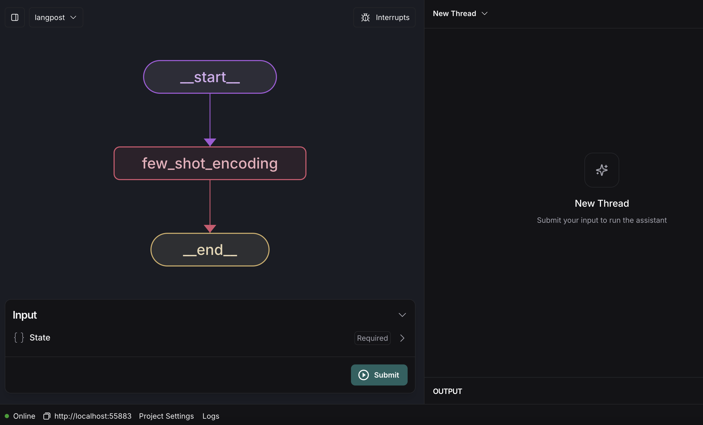
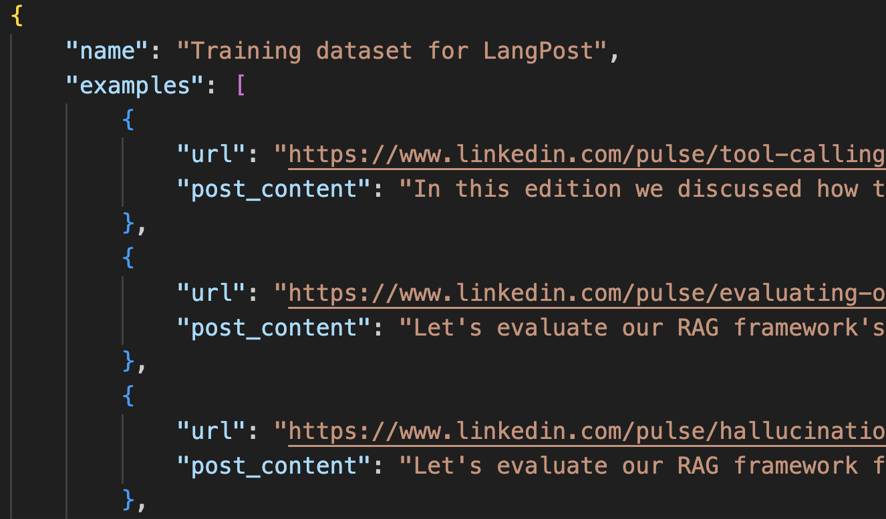

# LangPost - An AI Agent that creates a Linkedin Post :sparkles: :postbox:

LangPost is an AI agent that creates a Linkedin post from a Linkedin newsletter article or any other blog post.

 

 

## Dynamic Few-Shot encoding :trident:

It utilizes the concept of Few Shot encoding. I have an example dataset that maintains a list of Linkedin Post corresponding to my Newsletter Articles. The dataset looks somewhat like this.

 

 

I have made the LLM model aware of these examples so that it can generate similar posts on the basis of the content. The key benefit of providing the personalized examples is that the LLM can learn from these examples and produce a Linkedin Post very similar to my writing style and habit.

The execution graph looks like this.

https://github.com/user-attachments/assets/7ce2692c-106b-44a6-94e1-468878c29cdd

We provide the model with the URL of the article and it generates a personalized Linkedin Post for me after learning through the above examples.

## Installing Dependencies :syringe:

    - Install Typescript: npm install typescript
    - Install Dotenv: npm install dotenv
    - Install LangChain libraries: 
        - npm install langchain
        - npm install @langchain/community
        - npm install @langchain/langgraph

### Best Practices for a better Code Health :pushpin:

1. Use [Prettier](https://prettier.io/) to format the codebase.
2. Take a look at the [langraph.json](./langgraph.json) file to understand how it runs in **LangGraph Studio**.

